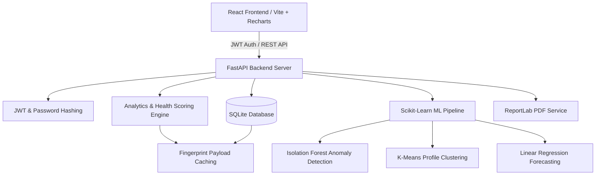
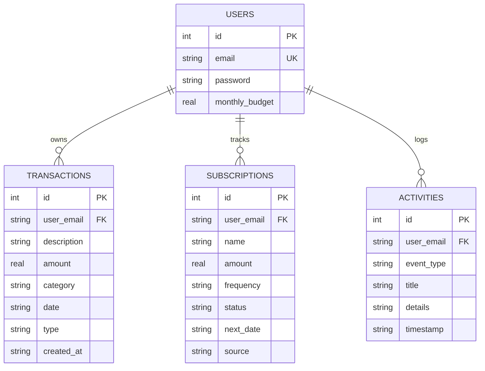

# FinPsych — Production-Grade AI Behavioral Finance Platform

FinPsych is a commercial-grade behavioral finance intelligence platform built with **FastAPI**, **React (Vite)**, **Recharts**, and **Scikit-Learn**. It transforms traditional personal expense tracking into an automated, explainable behavioral intelligence engine that provides real-time risk scoring, anomaly detection, profile clustering, linear regression forecasting, and dynamic AI financial coaching.

---

## 🌟 Key Features

### 1. 📊 Interactive Analytics Dashboard
* **Monthly Spending Trend**: Dynamic line chart tracking spending across months.
* **Expense Category Distribution**: Interactive pie chart displaying category percentages.
* **Income vs Expense**: Comparative bar chart of monthly inflows vs outflows.
* **Weekly Spending Trend**: Area chart summarizing week-over-week spending velocity.
* **Budget Utilization Progress**: Real-time progress bar with budget remaining alerts.
* **Forecast vs Actual Comparison**: Dual bar chart comparing actual spend, ML regression forecast, and budget cap.

### 2. 🧠 Behavioral Intelligence Profile
* **Automated Profile Classification**: Classifies users into behavioral archetypes (*Balanced Planner*, *Impulse Shopper*, *Weekend Spender*, *Convenience Buyer*, etc.).
* **Model Confidence & Explainability**: Displays exact confidence scores and plain-language reasoning for profile assignments.
* **Dominant Behaviors Grid**: Tracks budget discipline, impulse score, wellness score, savings consistency, weekend ratio %, and late-night ratio %.

### 3. 🤖 Explainable ML Pipeline (Scikit-Learn)
* **Isolation Forest Anomaly Detection**:
  * Fits an Isolation Forest model over transaction amounts.
  * Assigns anomaly scores, confidence levels, and explicit explanations (*"Purchase is 4.8x larger than average shopping transaction."*).
* **K-Means Clustering**:
  * Clusters multidimensional spending vectors (weekend %, late night %, food ratio, discretionary spend ratio).
* **Linear Regression Forecasting**:
  * Predicts end-of-month and next-month spending based on historical temporal patterns.
  * Displays R² confidence metrics and training data size.

### 4. 💯 Financial Health Score Engine (0–100)
Calculates a unified financial health score across six weighted behavioral factors:
1. **Savings Ratio** (25% weight)
2. **Budget Discipline** (25% weight)
3. **Risk Control** (20% weight)
4. **Impulse Control** (15% weight)
5. **Late Night Factor** (10% weight)
6. **Weekend Factor** (5% weight)

### 5. 🤖 Analytics-Grounded AI Financial Coach
* Provides dynamic financial advice grounded in real-time database analytics.
* References live spending totals, top categories, late-night ratios, budget buffer, and risk scores.

### 6. 💳 Professional Transactions Management
* **Search, Sort & Filter**: Filter by category, type (expense/income), date, and amount.
* **Pagination**: Server-side pagination with configurable page limits.
* **Bulk Operations**: Bulk delete and bulk category updating.
* **Undo Action**: Toast notification system with instant **Undo Delete** support.
* **Duplication**: One-click transaction duplication.

### 7. 📄 ReportLab PDF Report Generator
* Generates downloadable, executive-ready PDF financial reports with custom branding, cover headers, financial health breakdowns, anomaly audit tables, AI recommendations, and itemized transaction logs.

### 8. 📥 Smart Drag & Drop CSV Import
* Drag and drop bank statement CSV files.
* Automatic schema validation, valid/invalid row highlighting, and instant analytics recalculation.

### 9. 🔄 Subscription Detector
* Scans transactions for recurring services (Netflix, Spotify, Amazon Prime, YouTube Premium, Gym, Broadband).
* Allows users to confirm or ignore subscriptions with persistent SQLite status tracking.

---

## 🏗 Architecture Diagram



---

## 🗄 Database Schema (ER Diagram)



---

## 📁 Repository Directory Structure

```
FinPysch/
├── backend/
│   ├── analytics_service.py   # Analytics calculations, health score & timeline
│   ├── db.py                  # SQLite database connection & CRUD handlers
│   ├── main.py                # FastAPI endpoints & route handlers
│   ├── ml_engine.py           # Legacy ML helper functions
│   ├── ml_service.py          # Scikit-learn ML pipeline (IsoForest, KMeans, LinReg)
│   ├── pdf_service.py         # ReportLab PDF report generator
│   ├── security.py            # JWT token & password hashing service
│   ├── test_backend.py        # Automated backend unit & integration tests
│   └── finpsych.db            # SQLite database file
├── frontend/
│   ├── src/
│   │   ├── App.jsx            # Main dashboard component with tabbed views
│   │   ├── AuthPage.jsx       # Login & Registration component
│   │   ├── index.css          # Glassmorphism design system & styles
│   │   └── main.jsx           # React DOM entry point
│   ├── package.json           # React dependencies (Recharts, Lucide-React)
│   └── vite.config.js         # Vite dev server & build configuration
├── requirements.txt           # Python backend dependencies
└── README.md                  # System documentation
```

---

## 🚀 Quick Start Guide

### Prerequisites
* **Python**: 3.9 or higher
* **Node.js**: v18 or higher & `npm`

### Backend Setup
1. Navigate to the `backend` directory:
   ```bash
   cd backend
   ```
2. Install Python dependencies:
   ```bash
   pip install -r ../requirements.txt
   ```
3. Run the FastAPI development server:
   ```bash
   uvicorn main:app --reload --port 8000
   ```
   The backend API will be live at `https://finpsych.onrender.com/`.

### Frontend Setup
1. Open a new terminal and navigate to the `frontend` directory:
   ```bash
   cd frontend
   ```
2. Install frontend packages:
   ```bash
   npm install
   ```
3. Run Vite development server:
   ```bash
   npm run dev
   ```
4. Access the web application in your browser at `https://fin-psych.vercel.app/`.

---

## 🧪 Running Automated Tests

Run backend integration and ML regression tests:
```bash
python backend/test_backend.py
```

---

## 🔐 Security & Production Features
* **JWT Tokens**: Secure authentication tokens signed with HS256 algorithm.
* **Password Hashing**: SHA-256 with salted digest storage.
* **SQL Injection Protection**: Fully parameterized SQLite queries across all endpoints.
* **Rate Limiting**: Built-in HTTP 429 rate limiter middleware.
* **Response Caching**: Fingerprint cache key hashing to prevent redundant ML recalculations.

---

## 📄 License
This project is licensed under the MIT License.
